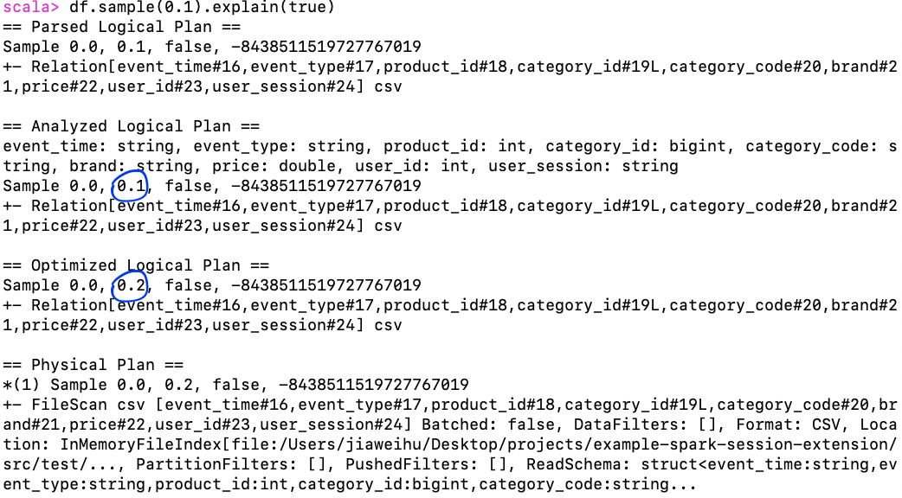

# Example Session Extension For Spark Session
Implementing a dummy optimization rule in Spark SQL to convert the sample `upperBound` from `0.1` to `0.2`.

# How to use
- Install `sbt`
- Clone the repo
  ```bash
  git clone git@github.com:Jiaweihu08/example-spark-session-extension.git
  ```
- Get the jar
  ```bash
  cd example-spark-session-extension
  sbt assembly
  ```
- Launch spark-shell
  ```bash
  $SPARK_HOME/bin/spark-shell \
  --jars ./target/scala-2.12/example-spark-session-extension-assembly-0.1.jar \
  --conf spark.sql.extensions=extensions.MySparkSessionExtension
  ```
- See changes in action
  ```bash
  val source = "/src/test/scala/resources/ecommerce300k_2019_Nov.csv"
   
  val df = (spark.read
            .option("header", "true")
            .option("inferSchema", "true")
            .csv(source))
  
  df.sample(0.1).explain(true)
  ```
  
  